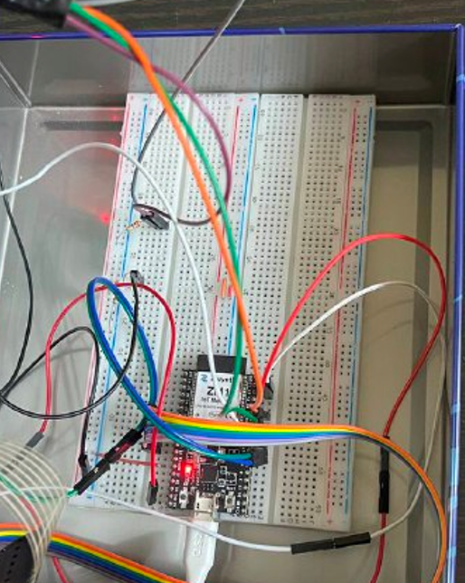
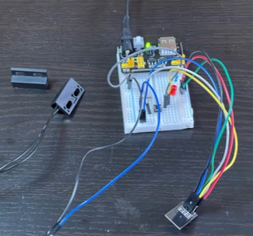
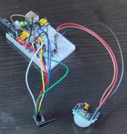

# NOCTUA
Noctua is a project that implements a smart anti-theft device. It consists of a series of smart devices that act as smart sensors and actuators. They are able to measure physical variables and/or to operate actions on the surrounding environment.
The system consists in two folders: *zerynth-hub* and *micropython-client*.
## zerynth-hub
The core of the system is represented from the *zerynth-hub* that communicates with the smart devices, giving them orders or getting informations from them.
The 'zerynth-hub' folder contains all the files and drivers useful for the central hub. In addition, it collects useful data and provides some functions to send them to *Zerynth Dashboard*.
The software in this folder is written in Python using the Zerynth JDK and a specific framework because the board (ZM1-BOARD) run a custom OS called Zerynth OS.
## central hub images

## micropython-client
The rest of the system consists in the smart devices.
The software contained in *micropython-client* folder is written in another specific Python framework, called *Micropython*. 
The smart devices built are: 
## 1. window/door sensors

## 2. movement sensors (infrared sensors)
